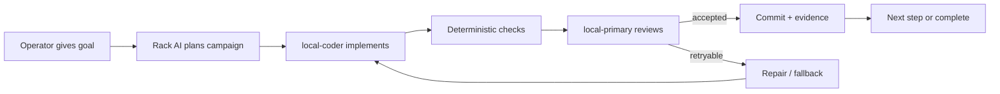
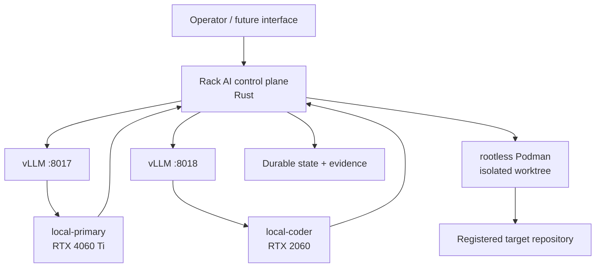

# Rack AI

<p align="center">
  <strong>Local autonomous software orchestration for a heterogeneous GPU rack.</strong>
</p>

<p align="center">
  
  
  
  
  
</p>

---

Rack AI is the control plane for a local AI rack. You give it a software goal, it coordinates the available local models and execution tools, carries the work through bounded implementation and review, and leaves durable evidence of what happened.

It is designed around one simple idea:

> **Give the rack a goal. Let it work. Keep the boundaries explicit.**

On `gpurack`, Rack AI currently coordinates:

- **`local-primary`** — reasoning, planning, coordination, verification, semantic review, and bounded fallback implementation
- **`local-coder`** — primary implementation worker
- **vLLM** — local OpenAI-compatible model serving
- **rootless Podman** — isolated execution against target repositories
- **Rust-owned orchestration** — campaigns, queues, leases, state, review, recovery, and control

## How Rack AI Behaves

Rack AI is a **fire-and-forget agentic execution system**, not a self-starting agent.

You give Rack AI an instruction or campaign. It then works autonomously within the boundaries of that request: planning, implementing, checking, reviewing, retrying or falling back where permitted, and recording the outcome.

It does **not** wake up and invent its own goals or begin modifying software without a submitted task.

A normal flow looks like this:



## Purposeful Boundaries

Rack AI is deliberately autonomous **inside** a small set of enforced boundaries:

- **Rack AI cannot modify its own running repository.**
- You give Rack AI a goal; it executes it autonomously.
- It does not invent its own goals or start work unprompted.
- Work is constrained by repository scope, safety policy, review, acceptance rules, retry limits, and operator control.

These are control boundaries, not limits on the kinds of software Rack AI can build.

A separate clone or checkout of Rack AI may be treated as a normal target repository, but the control plane should never modify the repository containing the code currently enforcing its own execution rules.

## What Rack AI Owns

Rack AI sits above model servers and coding tools. It owns:

- repository and workload registration
- model and worker role mapping
- task and pipeline submission
- durable queues, DAGs, leases, and campaign state
- isolated change execution against target repositories
- pause, resume, cancel, revise, retry, fallback, and recovery
- deterministic acceptance gates
- independent semantic review per implementation attempt
- operator-visible state, evidence, and review artifacts

The target repository is the workload. Rack AI remains the controller.

## Architecture



The Rust workspace is split into four main crates:

| Crate | Responsibility |
| --- | --- |
| `rack_ai_domain` | Small domain types and invariants |
| `rack_ai_application` | Campaign logic, orchestration use cases, reviews, state transitions |
| `rack_ai_infrastructure` | Git, filesystem, Podman, registry, path policy, worker integrations |
| `rack_ai_cli` | Operator commands and control surfaces |

Supporting areas:

- `bin/` — operational entry points used on the rack
- `config/` — worker, model, resource, repository, and template configuration
- `docs/` — architecture, workflow, safety, and engineering contracts
- `tests/` — unit, smoke, policy-boundary, and live-rack coverage
- `plugins/` — Python only where an external integration structurally requires it

## Execution Layers

### Direct rack tasks

Entry points such as:

- `bin/rack-primary`
- `bin/rack-coder`
- `bin/rack-coordinator`
- `bin/rack-task`

support direct single-worker and explicit pipeline execution.

### External-repository change workflow

`bin/rack-change` is the bounded implementation path for a registered target repository.

It prepares an isolated Git worktree, executes the worker through rootless Podman, enforces allowed paths, runs deterministic acceptance commands, and produces review evidence and an acceptance verdict.

### Autonomous campaigns

`bin/rack-campaign` runs bounded, restartable, multi-step unattended work with:

- persistent state
- durable heartbeats
- campaign and repository leases
- pause / resume / revise / cancel
- bounded retries and fallback
- deterministic gates
- independent coordinator review per attempt
- fail-closed continuity checks
- durable evidence

This is the primary path for longer fire-and-forget software work.

## Safety Model

Rack AI is intentionally conservative about **how** autonomous work is executed.

Key invariants include:

- target-repository work happens in isolated Git worktrees
- live implementation uses rootless Podman
- worker containers run with network disabled for repository mutation work
- changed files must remain inside declared allowed paths
- path authorization uses normalized path semantics rather than raw string prefixes
- required artifacts must exist before a step can pass
- acceptance commands are explicit and deterministic
- every implementation attempt receives independent semantic review
- retries and fallback are bounded
- model, command, review, and container operations are time-bounded
- campaign control state is durable and race-safe
- pause/cancel are checked before commit
- safety-sensitive uncertainty fails closed

See [`AGENTS.md`](AGENTS.md) and [`docs/engineering-contract.md`](docs/engineering-contract.md) for the standing engineering and agent rules.

## Current Backend Stance

The current rack uses two local OpenAI-compatible vLLM endpoints:

- `local-primary` — `http://127.0.0.1:8017/v1`
- `local-coder` — `http://127.0.0.1:8018/v1`

JCode remains available as a tool/backend where useful, but Rack AI does not rely on JCode swarm for core cross-provider orchestration.

JCode v0.78.1 demonstrated provider/endpoint rebinding problems on this rack, so the current architecture deliberately keeps orchestration and safety behaviour inside Rack AI. If upstream swarm behaviour becomes reliable in future, the integration can be simplified without changing the control-plane contract.

## Python Policy

The live control-plane path is Rust-owned.

Python is retained only where an external dependency structurally requires it, currently including the temporary vLLM plugin surface. Python is not the primary orchestration language for this repository.

## Operator Entry Points

| Command | Purpose |
| --- | --- |
| `bin/rack-healthcheck` | Endpoint and registry health |
| `bin/rack-submit` | Queue submission |
| `bin/rack-runner` | Queue and DAG runner |
| `bin/rack-status` | Run-state inspection |
| `bin/rack-task` | Explicit task and pipeline execution |
| `bin/rack-coordinator` | Template-driven task generation |
| `bin/rack-change` | Bounded external-repository change execution |
| `bin/rack-campaign` | Autonomous multi-step campaign execution |

## Current Project Status

### P0 — autonomous campaign execution

**Proven on the live rack.**

The current P0 contract includes:

- real local-model campaign execution
- primary coder and bounded fallback implementation
- rootless Podman mutation boundary
- deterministic acceptance gates
- independent semantic review
- durable state and heartbeats
- race-safe pause/cancel behaviour
- normalized path policy
- bounded retries, model calls, commands, and container execution
- retained implementation, Git, review, and campaign evidence
- live smoke coverage using the actual rack endpoints

### P1 — standalone operational hardening

**In progress under PR #4.**

P1 turns proven autonomous execution into a dependable long-running headless service by adding and proving operational concerns such as startup/restart, crash/reboot recovery, stale-resource cleanup, endpoint degradation handling, retention/disk controls, and soak testing.

Front-end and human-interface design are intentionally outside this phase.

## Testing

The repository contains coverage for:

- direct coder execution
- task and pipeline orchestration
- queue and DAG behaviour
- health and resource admission
- external-repository change preparation
- rootless Podman-backed implementation
- path-policy rejection
- autonomous campaigns
- pause/cancel/recovery behaviour
- live local-model campaign execution

Baseline verification:

```bash
cargo test --workspace --offline
bash tests/rack_change_executor_smoke.sh
bash tests/rack_change_implement_smoke.sh
bash tests/rack_change_path_policy_smoke.sh
bash tests/rack_campaign_smoke.sh
RACK_AI_LIVE_SMOKE=1 bash tests/rack_campaign_live_model_smoke.sh
```

Some smoke tests require rootless Podman, the prepared executor image, and healthy local model endpoints.

See [`tests/README.md`](tests/README.md) for the current smoke inventory.

## Engineering Standards

All human and AI contributors work to the same repository contract.

The short mandatory rules live in [`AGENTS.md`](AGENTS.md). The detailed rationale and safety contract live in [`docs/engineering-contract.md`](docs/engineering-contract.md).

Among other things, the standards require:

- small, cohesive Rust implementation units
- composition and explicit typed contracts
- no unexplained magic values
- bounded concurrency and external operations
- regression tests for behavioural and safety changes
- no weakening of tests to make changes pass
- no repository-maintained Rust `unsafe` without explicit human approval

## Key Documents

- [`AGENTS.md`](AGENTS.md) — mandatory coding and agent rules
- [`docs/engineering-contract.md`](docs/engineering-contract.md) — detailed engineering, safety, and Rust standards
- [`docs/external-repository-change-workflow.md`](docs/external-repository-change-workflow.md) — isolated repository mutation contract
- [`docs/autonomous-campaign-runner-contract.md`](docs/autonomous-campaign-runner-contract.md) — autonomous campaign behaviour
- [`docs/rust-application-architecture.md`](docs/rust-application-architecture.md) — application architecture
- [`config/README.md`](config/README.md) — runtime configuration
- [`tests/README.md`](tests/README.md) — smoke and live-test inventory

---

<p align="center">
  <strong>Rack AI: bounded autonomy for local hardware.</strong>
</p>
