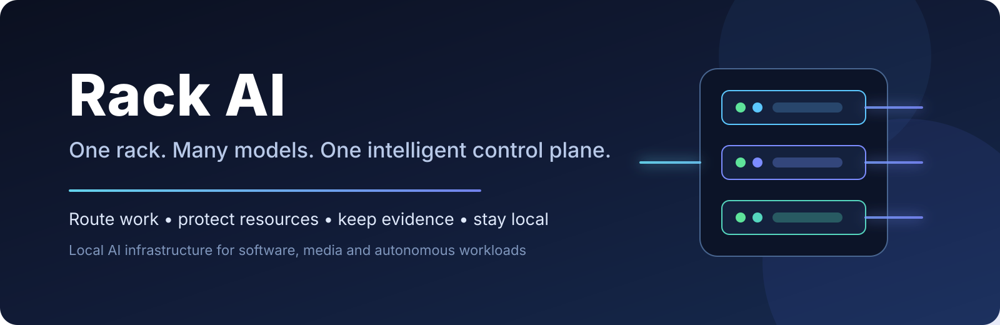

<div align="center">



<br />


### The control plane for a local AI rack

**Give Rack AI a job. It decides where it should run, protects the hardware and workspace, and returns a durable result.**

</div>

---

## What is Rack AI?

Rack AI turns a collection of GPUs, local AI models and execution tools into **one managed local AI platform**.

Instead of every application needing to know which GPU is free, which model is suitable, how much context it can handle, or how to run work safely, Rack AI takes responsibility for those decisions.

The goal is simple:

> **Applications should ask for a capability. Rack AI should decide the best way to provide it.**

Today the first major workload is autonomous software development. The longer-term goal is broader: one rack that can intelligently share its hardware across development, image generation, video, audio, reasoning and other AI workloads.

---

## What Rack AI does for you

<table>
<tr>
<td width="25%" valign="top">

### 📥 1. Accepts work

A client submits a bounded job and describes what capability it needs.

The client does not need to pick a specific GPU, local model or worker.

</td>
<td width="25%" valign="top">

### 🧠 2. Chooses the right resource

Rack AI matches the job to a qualified model and available hardware, using capability, complexity and resource rules.

**TBD:** richer global scheduling, pre-emption and multi-workload optimisation.

</td>
<td width="25%" valign="top">

### 🛡️ 3. Runs it safely

Work executes inside controlled boundaries with timeouts, path restrictions, trusted repository state and deterministic checks.

If something fails, Rack AI records a real failure rather than inventing success.

</td>
<td width="25%" valign="top">

### 📦 4. Returns evidence

The caller gets a structured result: what ran, where it ran, what changed and whether the job passed.

That makes local autonomous work auditable and restartable.

</td>
</tr>
</table>

---

## Why Rack AI?

### 🖥️ Treat local hardware like a shared AI service

A GPU rack is most useful when applications do not have to micromanage it. Rack AI is intended to make heterogeneous local hardware feel like one coherent resource pool.

### 💸 Get more value from smaller local models

Different jobs need different levels of intelligence. Rack AI can send straightforward work to cheaper, smaller models and preserve stronger resources for jobs that genuinely need them.

### 🔒 Keep control of your data and compute

The platform is local-first. Workloads can stay on hardware you own, with cloud services remaining optional rather than mandatory.

### 🧩 Let applications stay focused on their own job

A software-development system should think about software development. A media application should think about media. Neither should need to become a GPU scheduler.

Rack AI sits underneath those products and owns the shared execution problem.

### 🔍 Know what actually happened

Every serious autonomous system needs evidence. Rack AI is designed to retain execution state, selected resources, changed files, checks and terminal outcomes so that callers can trust the result rather than a model's description of the result.

---

## What can use Rack AI?

### 🧑‍💻 Autonomous software development

[ATHBA](https://github.com/Tommyboyjedi/ATHBA) is the first major client.

ATHBA decides **what software work means**. Rack AI decides **which qualified local resource should execute that work and how to execute it safely**.

That separation lets ATHBA concentrate on requirements, testing and software delivery while Rack AI concentrates on models, GPUs, execution and evidence.

### 🎨 Image and video generation — **TBD**

Rack AI is intended to coordinate GPU availability for tools such as ComfyUI and future image/video pipelines without replacing their own interfaces.

### 🎵 Audio and music workloads — **TBD**

The same resource layer is intended to support local audio generation, transformation and other GPU-backed media work.

### 🧠 General local reasoning and agent workloads — **TBD**

Future clients should be able to request broad capabilities such as reasoning, coding, visual or audio work without knowing the physical rack topology.

---

## The end product we are building

Rack AI is intended to become the **operating layer for a heterogeneous local AI machine**.

Planned capabilities include:

- one shared pool of GPUs, local models and execution workers;
- capability-based routing instead of hard-coded model selection;
- model qualification so only proven model/runtime combinations receive real work;
- automatic startup, shutdown and residency management for local models — **TBD**;
- safe switching between development and media workloads — **TBD**;
- image, video and audio workload scheduling — **TBD**;
- multi-GPU placement and resource optimisation — **TBD**;
- queue priority, fairness, ageing and pre-emption — **TBD**;
- smarter handling of temporarily unavailable resources — **TBD**;
- automatic recovery from failed or unhealthy workers;
- workload history, utilisation and capacity reporting — **TBD**;
- APIs and a human-facing operations dashboard — **TBD**;
- multi-project scheduling across several client applications — **TBD**.

The intent is not to hide specialist products. ComfyUI should still be ComfyUI; ATHBA should still be ATHBA. Rack AI simply gives all of them a safe and intelligent way to share the same local compute.

---

## Rack AI + ATHBA

The two projects deliberately have different responsibilities.

```text
ATHBA
"Build and prove this small piece of software"
        |
        v
Rack AI
"I will select a qualified local resource and execute it safely"
        |
        v
Local model / GPU / workspace
        |
        v
Structured result + evidence
```

ATHBA does not need to know which GPU or model Rack AI selected. Rack AI does not need to understand TDD, product requirements or software-development semantics.

That boundary is what allows Rack AI to serve many different products rather than becoming an ATHBA-specific backend.

---

## Current state

Rack AI is an active research and development project. This README describes the intended product; items marked **TBD** are planned or partially designed rather than complete.

### Proven / substantially implemented

- Rust-based local control plane.
- Qualified direct local-model execution using JCode.
- Trusted repository and workspace boundaries.
- Isolated, bounded repository-changing work.
- Timeouts, path controls and fail-closed execution.
- Deterministic acceptance checks and durable evidence.
- Persistent campaign state with retry, pause, resume and recovery controls.
- Dynamic trusted project workspaces.
- Real unattended software-development qualification on local models.

### Implemented and qualified in the active PR stack

The current stacked Rack AI work adds and validates:

- trusted host execution for prepared client environments;
- durable worker/model/resource execution provenance;
- a generic bounded workspace transaction for external clients;
- capability and complexity based worker selection;
- least-scarce-sufficient routing;
- source-specific priority admission;
- idempotent submissions and durable routing evidence.

These changes are currently represented by the open PR29–PR32 stack and are being exercised by ATHBA's live strict-TDD proving work.

### Next major product steps

- land and consolidate the active generic workspace/routing stack;
- finish the ATHBA end-to-end autonomous build proof;
- **TBD:** prove safe development ↔ ComfyUI resource switching;
- **TBD:** introduce broader media workload scheduling;
- **TBD:** add richer model lifecycle, residency and GPU utilisation management;
- **TBD:** expand from today's rack to more sophisticated multi-GPU scheduling once real workload evidence justifies it.

---

<details>
<summary><strong>Technical documentation</strong></summary>

For implementation, safety and operator details, see:

- [`docs/README.md`](docs/README.md)
- [`docs/control-plane-roadmap.md`](docs/control-plane-roadmap.md)
- [`docs/autonomous-campaign-runner-contract.md`](docs/autonomous-campaign-runner-contract.md)
- [`docs/external-repository-change-workflow.md`](docs/external-repository-change-workflow.md)
- [`docs/engineering-contract.md`](docs/engineering-contract.md)
- [`docs/athba-runtime-boundary.md`](docs/athba-runtime-boundary.md)
- [`AGENTS.md`](AGENTS.md)

Detailed model identities, endpoints, vLLM parameters, qualification evidence and operator commands belong in the technical documentation rather than this landing page.

</details>

---

## Project status

Rack AI is **not yet a finished general-purpose local AI resource platform**. The software-development execution path is the most mature part of the system and is being used to prove the architecture before broader GPU scheduling and media workloads are introduced.

## License

Proprietary.
